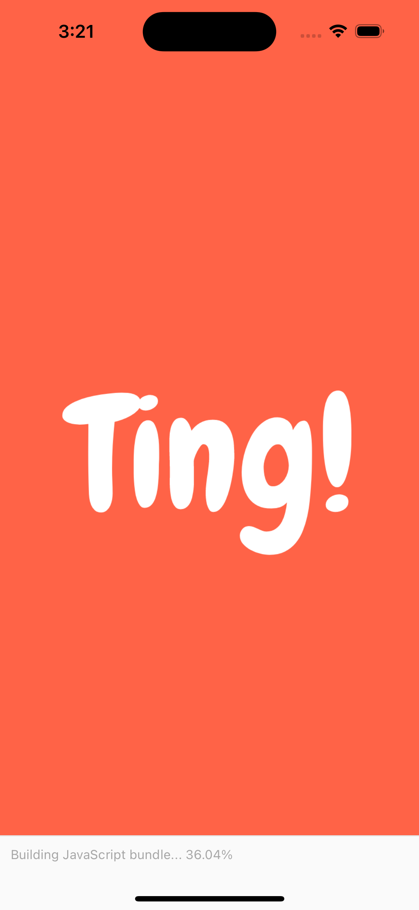
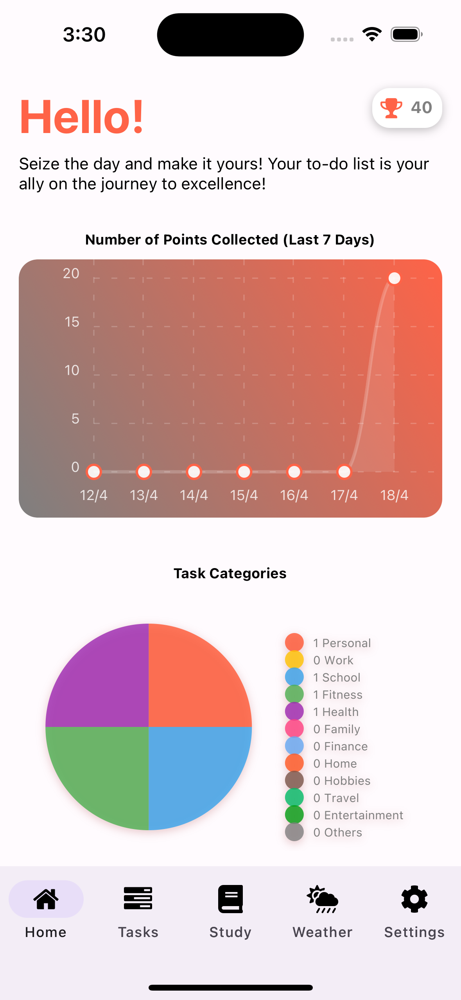
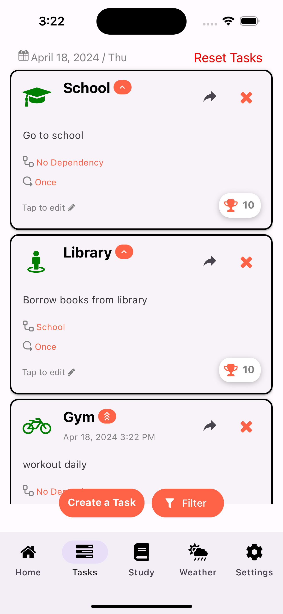
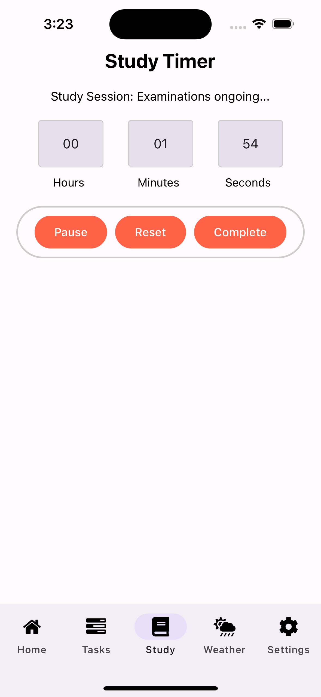
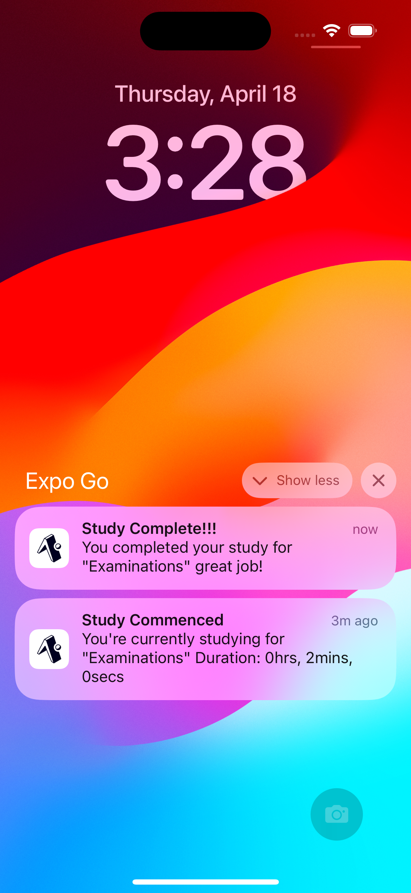
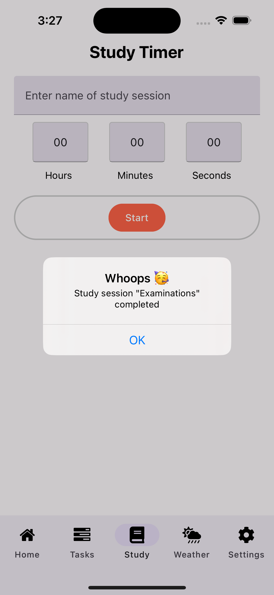
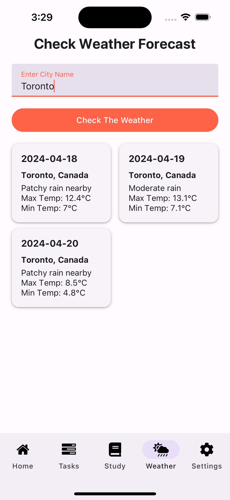
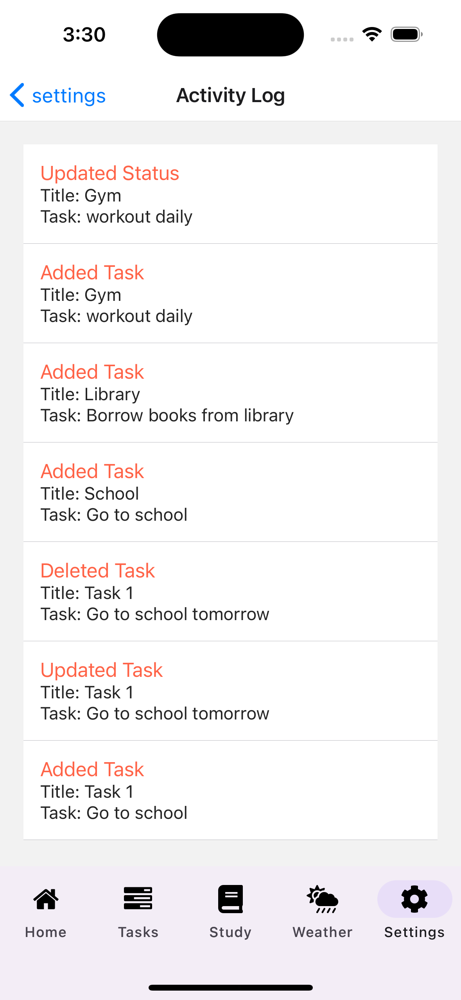

# TING!

## Welcome to Ting

Your ultimate companion for seamless organization and task management. This app is designed to simplify your life and enhance your productivity.

## Key Features

- **Task Management:**
  Easily create and manage your tasks with a user-friendly interface. Whether it's work assignments, personal errands, or study sessions, My Planner App ensures you stay on top of your schedule.

- **Task Editing and Deletion:**
  Enjoy the flexibility of editing or deleting specific tasks as your plans evolve. Adapt to changes effortlessly and keep your planner up-to-date with just a few taps.

- **Study Timer:**
  Boost your productivity with the built-in Study Timer feature. Set dedicated study sessions, track your progress, and achieve your academic goals with focused, timed study sessions.

- **Intuitive User Interface:**
  Our app boasts a sleek and intuitive design, ensuring a pleasant user experience. Navigate through the app effortlessly, making task management and planning a breeze.

## Technologies Used

- **React Native:**
  Harness the power of React Native for a cross-platform app that delivers a native-like experience on both iOS and Android devices.

- **Expo:**
  Simplify the development process with Expo, providing a set of tools and services that streamline React Native development.

- **Firebase:**
  Utilize Firebase for secure and scalable data storage. Your task data is stored in the cloud, offering accessibility and reliability.

## App Features

- Allow the user to create, manage, modify and withdraw tasks.
- Allow the user to filter the list of tasks.
- Set a color coding tag for each tasks.
- Set task recurrence (Once, Daily, Weekly, Monthly).
- Category based custom icon selection for tasks.
- Study Timer for focused study sessions.
- Display notification for timer(s) set.
- Reminders to user for uncompleted tasks with deadlines.
- Allow user delete all tasks - app reset (user data).
- Allow user to assign priority levels to tasks (high, medium, low).
- Allow users to set dependencies between tasks, ensuring that certain tasks cannot be started until others are completed.
- Award points for the user after completing each task and display the points they've earned.
- Display a dashboard that provides insights into the user's productivity trends over time.
- Task share feature (external)
- Activity Log
- Weather check feature to plan tasks

## Screenshots

### Splashscreen

  

### Dashboard

  

### Tasks

  

### Study Timer

  
  
  

### Weather Check

  

### Activity Log

  

